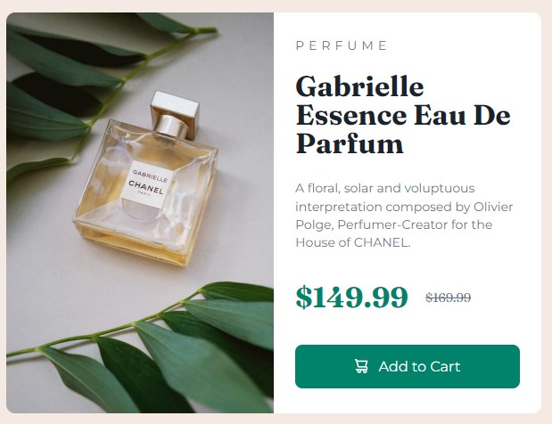

# Frontend Mentor - Product preview card component solution

This is a solution to the [Product preview card component challenge on Frontend Mentor](https://www.frontendmentor.io/challenges/product-preview-card-component-GO7UmttRfa). Frontend Mentor challenges help you improve your coding skills by building realistic projects. 

## Table of contents

- [Overview](#overview)
  - [The challenge](#the-challenge)
  - [Screenshot](#screenshot)
  - [Links](#links)
- [My process](#my-process)
  - [Built with](#built-with)
  - [What I learned](#what-i-learned)
  - [Continued development](#continued-development)
  - [Useful resources](#useful-resources)
- [Author](#author)
- [Acknowledgments](#acknowledgments)

## Overview

### The challenge

Users should be able to:

- View the optimal layout depending on their device's screen size
- See hover and focus states for interactive elements

### Screenshot

### Links

- Solution URL: [Product Preview Card Github](https://github.com/karthickg24/product-preview-card-component)
- Live Site URL: [Product Preview Card Site](https://karthickg24.github.io/product-preview-card-component)

## My process

### Built with

- Semantic HTML5 markup
- CSS custom properties
- Flexbox
- CSS Grid
- Mobile-first workflow

### What I learned

I have written CSS in BEM methodology. I m still learning it. I also implemented style in grid system. 

***I also learned...***

- ... that applying `box-radius` in container of image doesn't apply the box-radius to image. image will override style from parent. To make images inherit the styles, i used
`box-radius: inherit` in image
- ... about `.visually-hidden`, how it helps screen-headers to read content, yet content is hidden from displaying

https://www.a11yproject.com/posts/how-to-hide-content/

### Continued development

I want to learn and continue writing CSS in BEM methodology and understand how I can make my websites as accessible as possible.

### Useful resources

- [How to: Hide Content](https://www.a11yproject.com/posts/how-to-hide-content/) - This helped me to know little about visually hidden class. Use the styles.
- [How to plan your HTML: Product Preview Card](https://fedmentor.dev/posts/html-plan-product-preview/) - This article goes through the steps to complete this challenge with accessibility in mind.

## Author

- Frontend Mentor - [@yourusername](https://www.frontendmentor.io/profile/karthickg24)
